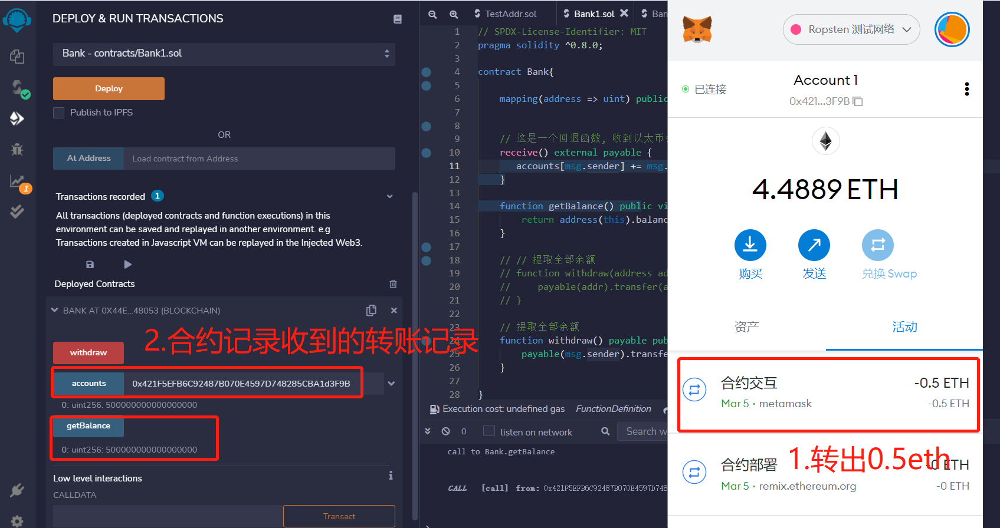
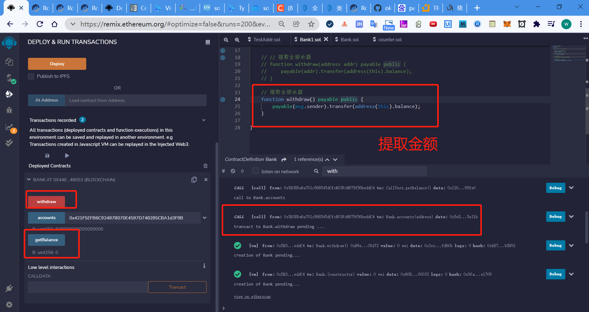

W2_1作业：
* 编写⼀个Bank合约：
* 通过 Metamask 向Bank合约转账ETH
* 在Bank合约记录每个地址转账⾦额
* 编写 Bank合约withdraw(), 实现提取出所有的 ETH

1.编写一个Bank合约
```
// SPDX-License-Identifier: MIT
pragma solidity ^0.8.0;

contract Bank{

    mapping(address => uint) public accounts;


    // 这是一个回退函数, 收到以太币会被调用
    receive() external payable {
       accounts[msg.sender] += msg.value;
    }

    function getBalance() public view returns (uint) {
        return address(this).balance;
    }

    // // 提取全部余额
    // function withdraw(address addr) payable public {
    //     payable(addr).transfer(address(this).balance);
    // }

    // 提取全部余额
    function withdraw() payable public {
        payable(msg.sender).transfer(address(this).balance);
    }

}
```
2.通过 Metamask 向Bank合约转账ETH
3.在Bank合约记录每个地址转账⾦额


3.编写 Bank合约withdraw(), 实现提取出所有的 ETH
