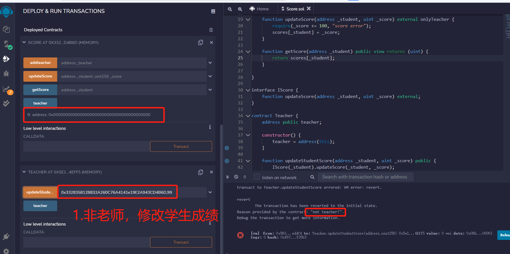
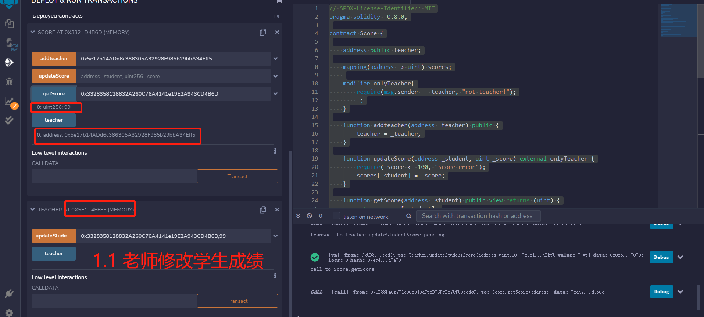
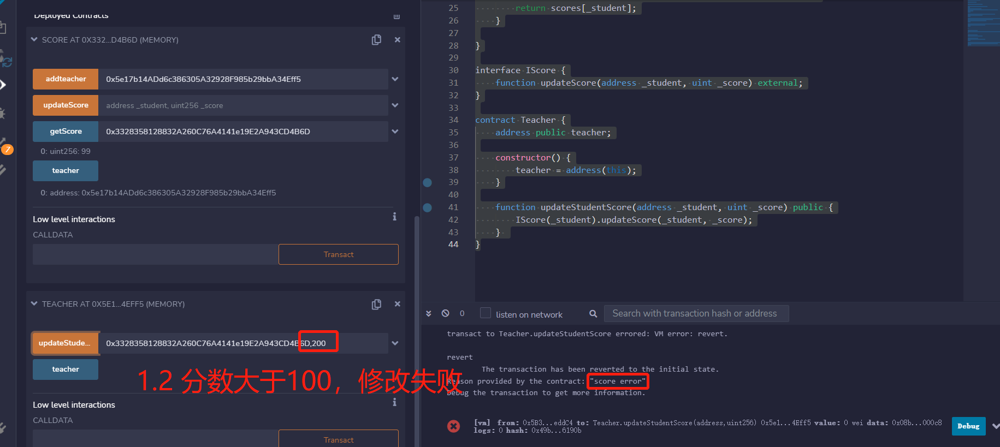

W2_2作业
* 编写合约Score，⽤于记录学⽣（地址）分数：
   * 仅有⽼师（⽤modifier权限控制）可以添加和修改学⽣分数
   * 分数不可以⼤于 100； 
* 编写合约 Teacher 作为⽼师，通过 IScore 接⼝调⽤修改学⽣分数。

--- 
1. 编写合约Score，⽤于记录学⽣（地址）分数：  
    1.1 仅有⽼师（⽤modifier权限控制）可以添加和修改学⽣分数  
    
    
     
    1.2 分数不可以⼤于 100；  
    

```
// SPDX-License-Identifier: MIT
pragma solidity ^0.8.0;

contract Score {

    address public teacher;

    mapping(address => uint) scores;
    
    modifier onlyTeacher{
        require(msg.sender == teacher, "not teacher!");
        _;
    }

    function addteacher(address _teacher) public {
        teacher = _teacher;
    }

    function updateScore(address _student, uint _score) external onlyTeacher {
        require(_score <= 100, "score error");
        scores[_student] = _score;
    }

    function getScore(address _student) public view returns (uint) {
        return scores[_student];
    }

}

interface IScore {
    function updateScore(address _student, uint _score) external;
}

contract Teacher {
    address public teacher;

    constructor() {
        teacher = address(this);
    }

    function updateStudentScore(address _student, uint _score) public {
        IScore(_student).updateScore(_student, _score);
    } 
}
``` 