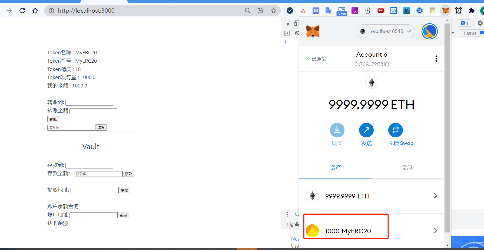
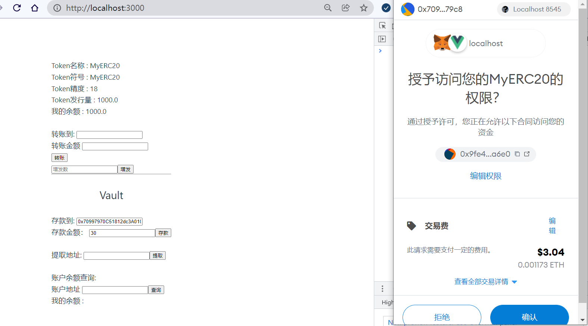
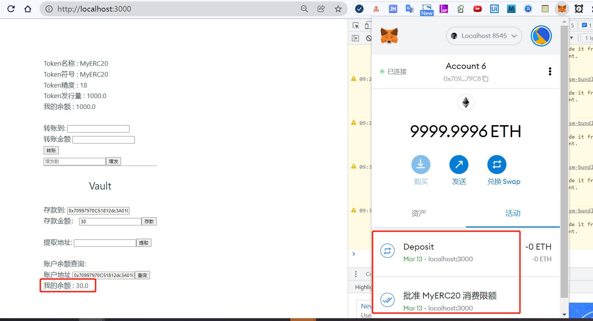
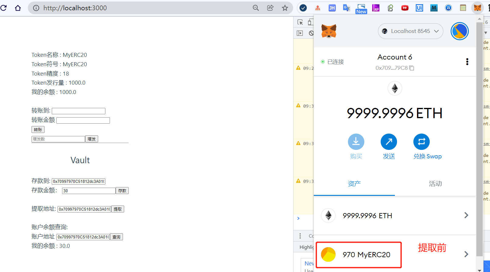
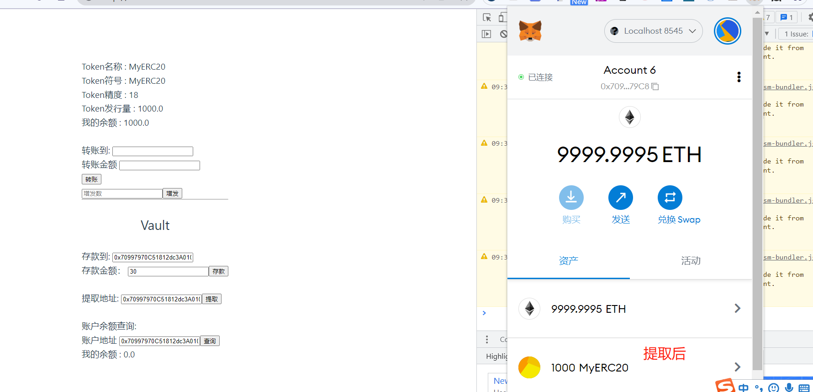
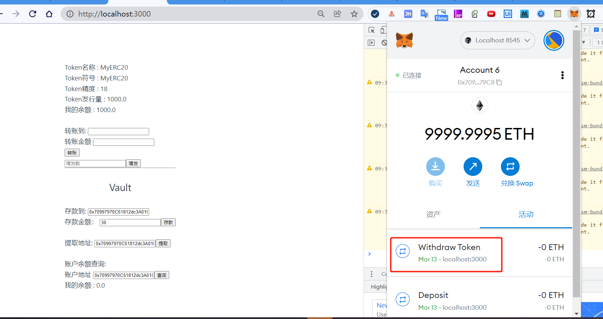
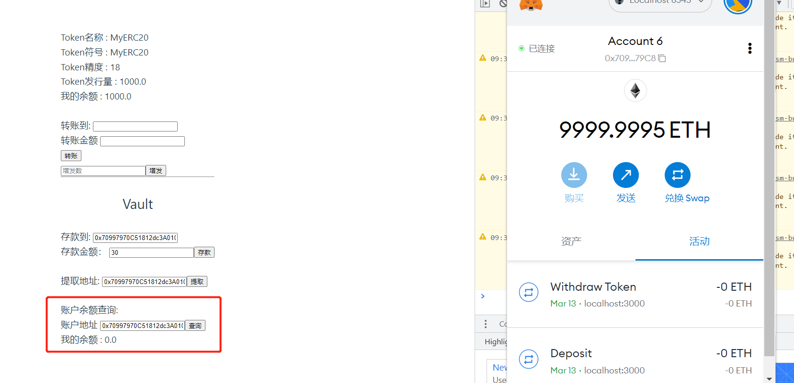

W3_1作业
* 发⾏⼀个 ERC20 Token： 
  * 可动态增发（起始发⾏量是 0） 
  * 通过 ethers.js. 调⽤合约进⾏转账
* 编写⼀个Vault 合约：
  * 编写deposite ⽅法，实现 ERC20 存⼊ Vault，并记录每个⽤户存款⾦额 ， ⽤从前端调⽤（Approve，transferFrom） 
  * 编写 withdraw ⽅法，提取⽤户⾃⼰的存款 （前端调⽤）
  * 前端显示⽤户存款⾦额

---
1). 发⾏⼀个 ERC20 Token： 
  * 可动态增发（起始发⾏量是 0） 
  * 通过 ethers.js. 调⽤合约进⾏转账

2). 编写⼀个Vault 合约：
  * 编写deposite ⽅法，实现 ERC20 存⼊ Vault，并记录每个⽤户存款⾦额 ， ⽤从前端调⽤（Approve，transferFrom） 
  * 编写 withdraw ⽅法，提取⽤户⾃⼰的存款 （前端调⽤）
  * 前端显示⽤户存款⾦额  
  1.初始金额1000 MyERC20  
    
  2.存款到Vault 30  
  2.1 approve  
    
  2.2 transferForm  
    
  3.前端调用提取⽤户⾃⼰的存款   
  
  
    
  4.展示用户余额  
  